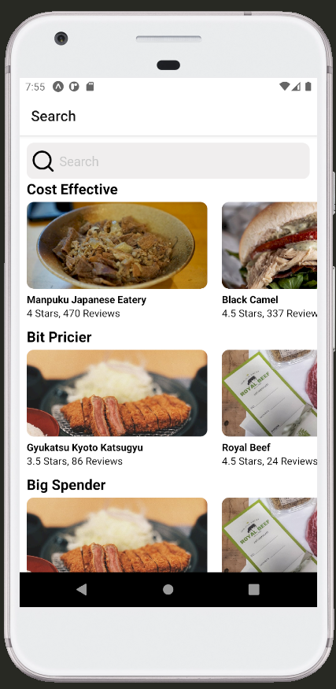

# Restaurant-Finder-
This project is being developed to learn react native.  
This mobile application uses YELP API to get data and sorts the restaurants based on 3 price categories (Cost effective, bit pricier, big spender).  
The restaurants shown are near user's location.  
 </img>
